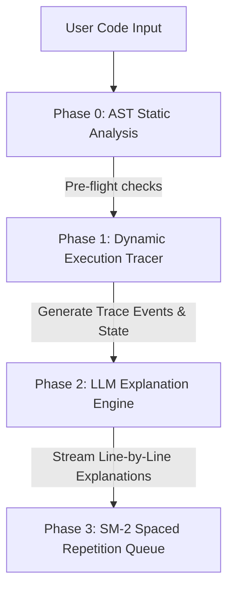

# CogniTrace — Interactive Python Code Tracer & AI Tutor

CogniTrace is an educational platform designed to help programming learners understand Python code execution dynamically. By bridging the gap between raw execution states and conceptual understanding, CogniTrace performs AST static analysis, dynamic code tracing, and real-time LLM explanation streaming to help users master Python logic.

---

## 🚀 Core Pipeline Architecture

The application processes code input through a robust four-phase execution pipeline:



### 🔍 Phase 0: AST Static Analysis
Before executing untrusted code, a lightweight AST parser checks for anti-patterns and potential bugs:
- **Unhandled None Checks**: Flags potential `NoneType` attribute/subscription access.
- **Unbounded Recursion**: Detects self-referential functions without clear base cases.
- **Implicit Collection Mutation**: Identifies loop modifications of dictionary/list containers.
- **Type Coercion Issues**: Catches operations guaranteed to raise a `TypeError` at runtime.

### ⚙️ Phase 1: Dynamic Execution Tracer
Spawns an isolated Python subprocess that uses `sys.settrace()` to trace execution step-by-step:
- Captures line-by-line variable modifications, function calls, returns, exceptions, and stdout.
- Limits resources (5-second timeout, 500-step execution limit) to prevent CPU starvation or infinite loops.
- Enforces a sandbox policy that intercepts or blocks hazardous calls (file writes, networking, subprocesses).

### 🧠 Phase 2: LLM Explanation Engine
Receives execution frames (variables, output, AST context) and streams insights back to the client:
- Streams tokens in real-time via **Server-Sent Events (SSE)**.
- Enforces grounded prompt contexts to explain *exactly why* a value changed or why a branch was taken.
- Integrates a content-addressable caching system to bypass LLM generation for identical trace steps.

### 🗂️ Phase 3: Spaced Repetition Queue
Implements the **SuperMemo-2 (SM-2)** scheduling algorithm to store and present review cards:
- Schedules reviews based on user self-ratings (`Again`, `Hard`, `Good`, `Easy`).
- Automatically updates card metrics (interval, repetition count, easiness factor) on Supabase.

---

## 🛠️ Stack & Technologies

*   **Frontend**: Next.js 15 (App Router), React 19, TypeScript, Lucide, Monaco Editor
*   **Backend**: FastAPI, AST, Custom Bytecode Tracer Sandbox
*   **Database & Auth**: Supabase (Postgres & Auth)
*   **Rate Limiting & Cache**: Redis
*   **AI Integration**: Three-tier routing: Ollama Cloud (Primary) → Local Ollama → OpenAI/Claude (Fallback)
*   **Testing**: pytest (Backend), Vitest (Frontend), Playwright (E2E)

---

## 🏗️ Key Engineering Decisions

### 1. Sandbox Isolation & AST Validation
To safely run arbitrary Python code, CogniTrace couples static pre-flight validation with strict runtime tracing. Static checks reject malicious imports or structures before they run. At runtime, the sandbox restricts disk, network, and system API access using `sys.settrace()` and operating-system limits (`setrlimit`).

### 2. Bytecode-Level Branch Detection
Rather than just reporting which line executed, CogniTrace inspects CPython opcodes to capture:
- **Conditional Branching**: Whether an `if`/`else` condition was true or false.
- **Boolean Short-Circuiting**: Explaining exactly why a compound logical expression (like `and` / `or`) evaluated early.
- **Loop Progression**: Track iteration indexes of `for` and `while` structures.

### 3. Distributed Rate Limiting & Three-Tier AI Router
- **Redis & Lua**: Rate-limits requests across all instances using atomic Lua scripts (default limit is 20/hour for anonymous, unlimited for Pro).
- **Explanation Cache**: Traces are content-addressed using SHA-256 hashes of `(code + line_number + variables)` to instantly serve cached explanations.

---

## 🗂️ Project Structure

```
cognitrace/
├── backend/
│   ├── app/
│   │   ├── main.py           # FastAPI server & CORS policies
│   │   ├── config.py         # Configuration settings (BaseSettings)
│   │   ├── routers/          # API Route controllers (/traces, /llm, /review, /profiles)
│   │   └── services/         # Business logic (rate limiter, LLM router, tracer runner)
│   ├── tracer/               # Bytecode tracer & instrumentation module
│   │   ├── tracer.py         # sys.settrace() implementation & branch detection
│   │   ├── validator.py      # AST static rule enforcement
│   │   └── models.py         # Trace payload schemas
│   ├── migrations/           # Supabase DB schema & seed scripts
│   └── tests/                # pytest unit & integration suite
├── frontend/
│   ├── app/                  # Next.js App Router (pages & layouts)
│   ├── components/           # UI elements (Monaco editor, TraceAnimator, Panels)
│   ├── hooks/                # Custom React Hooks (useTrace, useStreamingExplanation)
│   ├── lib/                  # Services and utility helpers (api Client, SM-2 logic)
│   └── i18n/                 # Localization files (EN/VI translation support)
├── docker-compose.yml         # Dev environment container orchestrator
└── README.md
```

---

## 🚦 Getting Started

### Method A: Quick Start via Docker Compose (Recommended)

Docker Compose boots up the backend, frontend, database, migrations, and caching layers with a single command.

1. Ensure **Docker** and **Docker Compose** are installed and running.
2. In the project root, create a `.env` file using the docker settings:
   ```bash
   # Add your specific local variables to the .env file in the root
   POSTGRES_PASSWORD=your_postgres_password
   SUPABASE_ANON_KEY=your_anon_key
   SUPABASE_SERVICE_KEY=your_service_role_key
   ```
3. Build and launch the stack:
   ```bash
   docker compose up --build
   ```
4. Access the services:
   - **Frontend**: http://localhost:3000
   - **API Docs (Swagger)**: http://localhost:8000/docs
   - **Supabase Studio**: http://localhost:3001

---

### Method B: Manual Local Setup (Step-by-Step)

If you prefer running the components directly on your host machine:

#### 1. Setup Backend
1. Navigate to the backend directory and activate a virtual environment:
   ```bash
   cd backend
   python -m venv venv
   source venv/bin/activate  # On Windows: venv\Scripts\activate
   ```
2. Install dependencies:
   ```bash
   pip install -r requirements.txt
   ```
3. Copy the environment template and populate it:
   ```bash
   cp .env.example .env
   ```
4. Start the FastAPI application:
   ```bash
   uvicorn app.main:app --reload
   ```

#### 2. Setup Frontend
1. Navigate to the frontend directory:
   ```bash
   cd frontend
   npm install
   ```
2. Copy the environment variables:
   ```bash
   cp .env.test.example .env.local
   ```
3. Run the Next.js development server:
   ```bash
   npm run dev
   ```

---

## 🔑 Environment Variables Configuration

Copy `backend/.env.example` to `backend/.env`. Essential configurations include:

| Environment Variable | Description | Default / Example |
| :--- | :--- | :--- |
| `OLLAMA_CLOUD_URL` | Endpoint for Ollama Cloud (default is primary free explanation provider) | `https://ollama.com/api` |
| `GITHUB_MODELS_PAT` | Optional token for GitHub Models fallback access | `ghp_your_pat_token` |
| `SUPABASE_URL` | Supabase endpoint URL for user authentication and state synchronization | `http://localhost:54321` |
| `SUPABASE_SERVICE_KEY`| Service role key for admin-level database operations | `postgres` |
| `REDIS_ENABLED` | Toggle distributed rate limiting | `false` |
| `REDIS_URL` | Connection string to the Redis cache cluster | `redis://localhost:6379` |

---

## 🧪 Testing Suite

CogniTrace enforces strict coverage checks across both backend and frontend layers:

### Run Backend Unit & Integration Tests
```bash
cd backend
pip install -e ".[dev]"
pytest
```

### Run Frontend Vitest Tests
```bash
cd frontend
npm run test
```

### Run Playwright End-to-End Tests
Ensure the full stack is running (using either Docker or local uvicorn + npm dev), then execute:
```bash
cd frontend
npx playwright test
```

---

## 🔒 Security & Sandbox Warning

> [!WARNING]
> The dynamic execution tracer runs user-submitted Python code. Although locked down via `sys.settrace()`, instruction caps, and sandboxing, **do not host this application on a public-facing server without additional OS-level container isolation** (such as lightweight Docker sandboxes or microVMs like Firecracker).

---

## 📄 License
Licensed under the [MIT License](LICENSE).
