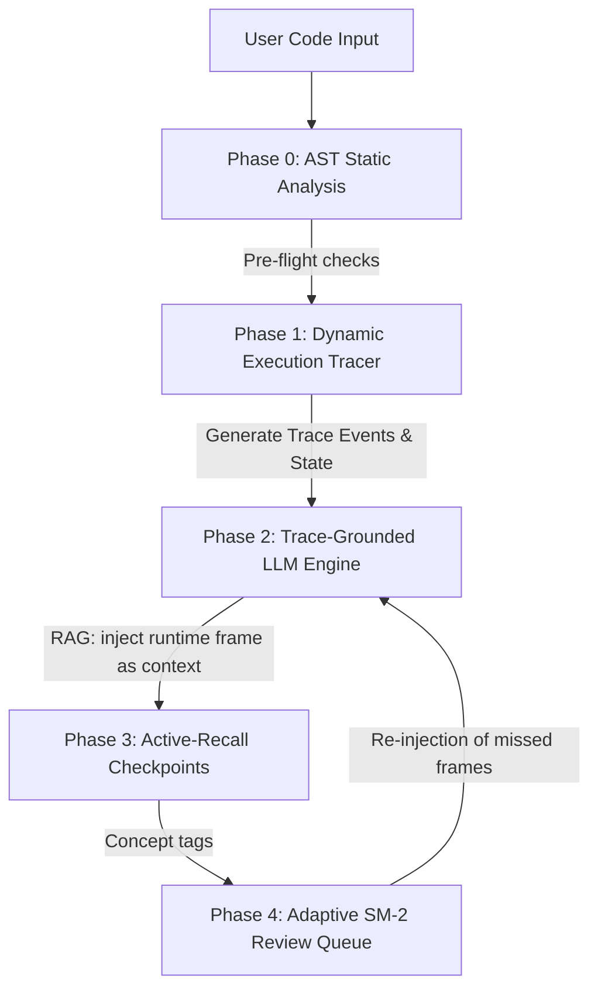

# CogniTrace — A State-Grounded AI Tutor for Personalized Programming Support

> **Thesis title (submitted):** *A State-Grounded AI Tutor for Personalized Programming Support Using Large Language Models.*
>
> **"State" here is dual-axis.** Every AI response in CogniTrace is conditioned on two state representations at once: (1) the **runtime state** of the program — variables, branch outcomes, call frames — captured by deterministic execution fingerprints; and (2) the **cognitive state** of the learner — per-concept mastery, recent misconception history, and a quantitative cognitive-load estimate. The unification of these two grounding signals in one tutor loop is the central contribution.
>
> Research-framed README — what we built, why it is novel, what we measured. The engineering walk-through (pipeline, configuration, deployment) lives at [`README.engineering.md`](README.engineering.md). The full study protocol is at [`docs/THESIS-01-STUDY-PROTOCOL.md`](docs/THESIS-01-STUDY-PROTOCOL.md). The abstract and contributions are at [`docs/THESIS-00-ABSTRACT.md`](docs/THESIS-00-ABSTRACT.md) and [`docs/THESIS-02-CONTRIBUTIONS.md`](docs/THESIS-02-CONTRIBUTIONS.md).

---

## Research Position

Novice programmers increasingly rely on conversational AI assistants (ChatGPT, GitHub Copilot, Khanmigo) to generate and explain code. These assistants are blind to two kinds of state at once: they **hallucinate about runtime state** — describing what code *probably* does rather than what it *actually* did in the student's specific execution — and they are equally blind to **cognitive state** — current mastery, recent misconceptions, and cognitive load — and so deliver one-size-fits-all explanations regardless of what the student is actually struggling with. Students then copy-paste generated code without building the mental model of control flow that debugging requires.

**CogniTrace is an AI tutoring system that grounds every LLM response in both runtime state and learner state simultaneously.** On the runtime axis it treats the execution trace as a retrieval corpus (RAG) and emits deterministic execution fingerprints for every frame. On the learner axis it tracks per-concept mastery (adaptive spaced repetition), estimates cognitive load from trace complexity + interaction events, and adapts prompt difficulty and review scheduling to the student's profile. It also injects active-recall checkpoints at branch points (LLM-driven pedagogy). The central research question is whether dual state grounding improves debugging comprehension in CS1 students compared to ungrounded LLM chat.

This thesis is a **within-subjects empirical study**, not a feature showcase. See [`docs/THESIS-00-ABSTRACT.md`](docs/THESIS-00-ABSTRACT.md) for the abstract, [`docs/THESIS-00-RESEARCH-QUESTIONS.md`](docs/THESIS-00-RESEARCH-QUESTIONS.md) for the research questions and pre-registered hypothesis, and [`docs/THESIS-01-STUDY-PROTOCOL.md`](docs/THESIS-01-STUDY-PROTOCOL.md) for the full protocol.

---

## Research Contributions

1. **Runtime-state-grounded retrieval-augmented generation (RAG) for code explanation.** The execution trace is a structured retrieval corpus; each LLM response is conditioned on the exact `(code, line_number, variable_state)` frame. This addresses hallucination about runtime values, which is the dominant failure mode of LLM code tutors as of 2026.

2. **Learner-state-grounded prompt construction and review scheduling.** Each prompt is additionally conditioned on the learner's cognitive-load estimate, per-concept mastery, and recent misconception history (T1-A + T1-C). Review intervals adapt per concept, not per item.

3. **LLM-generated active-recall checkpoints at control-flow branches.** At each conditional, loop boundary, or call site, the system pauses execution and prompts the student to *predict* the next variable state or branch outcome — converting passive observation into active retrieval, the cognitive principle with the strongest empirical support for durable learning (Karpicke & Roediger, 2008).

4. **Empirical evaluation against two baselines.** A within-subjects study (N=24, CS1 students) comparing three conditions on debugging comprehension and transfer: (a) Python Tutor alone, (b) Python Tutor + ungrounded ChatGPT, (c) CogniTrace.

The four contributions are independently defensible — see [`docs/THESIS-02-CONTRIBUTIONS.md`](docs/THESIS-02-CONTRIBUTIONS.md).

---

## AI Architecture in One View


```mermaid
graph TD
    A[User Code Input] --> B[Phase 0: AST Static Analysis]
    B -->|Pre-flight checks| C[Phase 1: Dynamic Execution Tracer]
    C -->|Generate Trace Events & State| D[Phase 2: Trace-Grounded LLM Engine]
    D -->|RAG: inject runtime frame as context| E[Phase 3: Active-Recall Checkpoints]
    E -->|Concept tags| F[Phase 4: Adaptive SM-2 Review Queue]
    F -->|Re-injection of missed frames| D
```

| Layer | AI technique | Why it matters |
|---|---|---|
| Trace → LLM prompt | Retrieval-Augmented Generation (RAG) | Grounds every response in real runtime state, eliminating hallucination about variable values |
| Branch analysis → checkpoint prompts | LLM-driven active recall | Forces prediction at decision points, the cognitive mechanism behind durable learning |
| Concept tagging → SM-2 schedule | Adaptive spaced repetition (LLM-informed) | Schedules reviews per concept, not per item, so retention tracks the actual struggling point |
| `(code, line, state)` hash → cache | Content-addressed LLM serving | Reuses explanations for identical frames; eliminates redundant API cost and latency |

---

## Why This Is Not "Python Tutor + ChatGPT"

| Existing tool | What it does | What CogniTrace adds |
|---|---|---|
| Python Tutor | Visualizes execution state | Adds runtime-state-grounded explanations + learner-state-grounded prompting + active-recall checkpoints + adaptive review |
| ChatGPT / Claude chat | Generates code and answers questions about it | Cannot see the student's actual runtime state nor learner state; hallucinates about variable values and ignores per-concept mastery |
| Khanmigo | Conversational AI tutor across subjects | Not trace-aware; no runtime grounding; no learner-state channel; no per-concept retention tracking |
| Cursor / Copilot | Inline code completion | Does not teach control flow or evaluate learner comprehension |

Every layer above is built on the existing system. Nothing has been changed. What changed is the *vocabulary used to describe the system* — and that vocabulary is what makes the same code look like a research contribution instead of a feature combination.

---

## Engineering Substrate

The system is implemented as a strict unidirectional pipeline. Full architecture, request lifecycle, and failure modes are documented at [`docs/ARCHITECTURE.md`](docs/ARCHITECTURE.md).

### 🔍 Phase 0 — AST Static Analysis
Pre-flight checks for anti-patterns and potential bugs (`None` access, unbounded recursion, mutable defaults, guaranteed `TypeError` operations).

### ⚙️ Phase 1 — Dynamic Execution Tracer
An isolated Python subprocess uses `sys.settrace()` to capture line-by-line variable modifications, function calls, returns, exceptions, and stdout. Resource limits (5s timeout, 500-step ceiling, sandboxed `setrlimit`) prevent infinite loops and resource exhaustion. The two-tier sandbox model and residual risks are documented at [`docs/SECURITY-SANDBOX.md`](docs/SECURITY-SANDBOX.md).

### 🧠 Phase 2 — Trace-Grounded LLM Engine
Receives execution frames and streams explanations back via SSE. The prompt is **conditioned on the actual variable state at the current line**, so the LLM cannot fabricate runtime values. A content-addressed cache (SHA-256 over `(code, line_number, variables)`) eliminates redundant calls. Token and latency telemetry flows to [`docs/MEASUREMENT.md`](docs/MEASUREMENT.md).

### ❓ Phase 3 — Active-Recall Checkpoints
At conditional branches, short-circuit evaluations, loop iterations, and call sites, the system pauses and prompts the student to predict the next state. The response is logged as a concept tag for downstream scheduling.

### 🗂️ Phase 4 — Adaptive SM-2 Review Queue
Implements the SuperMemo-2 algorithm with a custom **soft-fail** mechanism for the `Hard` rating: instead of resetting the interval completely (which causes student frustration), the interval and repetition count are halved, keeping the card in the active review pool.

---

## Stack

*   **Frontend**: Next.js 15 (App Router), React 19, TypeScript, Lucide, Monaco Editor
*   **Backend**: FastAPI, AST, custom bytecode tracer (`sys.settrace()` + `dis`)
*   **Database & Auth**: Supabase (Postgres + Auth)
*   **Cache & Rate Limiting**: Redis
*   **LLM Routing**: Ollama Cloud (primary) → Local Ollama → OpenAI/Claude (fallback)
*   **Testing**: pytest (backend), Vitest (frontend), Playwright (E2E). See [Testing](#testing) for current counts.

---

## Project Structure

```
cognitrace/
├── backend/
│   ├── app/                    # FastAPI server, routers, services
│   ├── tracer/                 # Bytecode tracer & instrumentation
│   ├── migrations/             # Supabase schema
│   └── tests/                  # pytest unit & integration suite
├── frontend/
│   ├── app/                    # Next.js App Router
│   ├── components/             # TraceAnimator, VariablePanel, TutorChallenge
│   ├── hooks/                  # useTrace, useStreamingExplanation
│   └── lib/                    # API client, SM-2 logic
├── docs/
│   ├── THESIS-00-ABSTRACT.md             # 250-word thesis abstract
│   ├── THESIS-00-RESEARCH-QUESTIONS.md   # RQs, hypotheses, pre-registration
│   ├── THESIS-02-CONTRIBUTIONS.md        # Four named contributions
│   ├── THESIS-01-STUDY-PROTOCOL.md       # IRB protocol, study design
│   ├── ARCHITECTURE.md                   # System architecture
│   ├── SECURITY-SANDBOX.md               # Sandbox model and residual risks
│   ├── MEASUREMENT.md                    # What is measured, where it lives
│   └── slide_deck_presentation_script.md
├── CONTRIBUTING.md
├── README.md                  # This file (research-framed overview)
└── README.engineering.md      # Engineering walk-through
```

---

## Getting Started

### Quick Start (Docker Compose)
```bash
docker compose up --build
```
Then open:
- Frontend: http://localhost:3000
- API docs: http://localhost:8000/docs
- Supabase Studio: http://localhost:3001

### Manual Setup
See the engineering README ([`README.engineering.md`](README.engineering.md)) for step-by-step backend and frontend installation.

---

## Testing

```bash
cd backend && pip install -e ".[dev]" && pytest
cd frontend && npm install && npm run test
cd frontend && npx playwright test                  # E2E flow
```

The current number of collected tests is surfaced automatically on every CI run as a job summary. Locally:

```bash
cd backend && pytest --collect-only -q | tail -1
```

The CI workflow (`.github/workflows/ci.yml`) enforces a backend coverage floor of 80% and a frontend coverage floor of 80%.

---

## Security Warning

> [!WARNING]
> The dynamic execution tracer runs user-submitted Python code. Although locked down via `sys.settrace()`, instruction caps, and `setrlimit`, do not deploy this application to a public-facing server without additional OS-level container isolation (Docker sandboxes or microVMs like Firecracker). See [`docs/SECURITY-SANDBOX.md`](docs/SECURITY-SANDBOX.md) for the full risk model.

---

## License

MIT. See [`LICENSE`](LICENSE).
