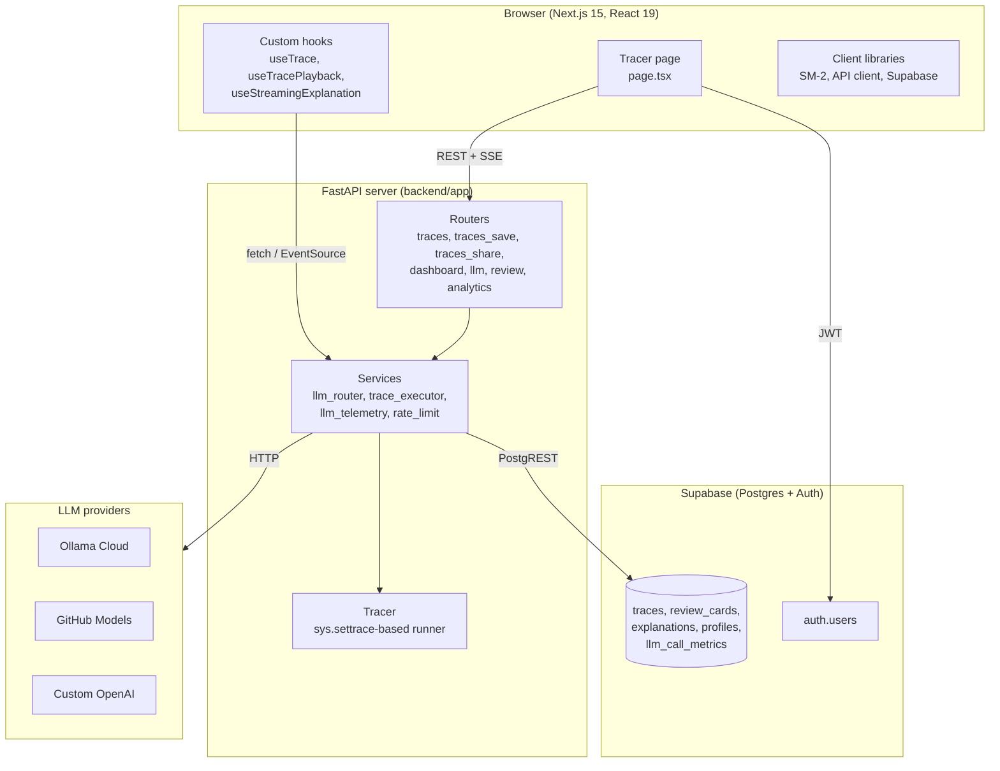
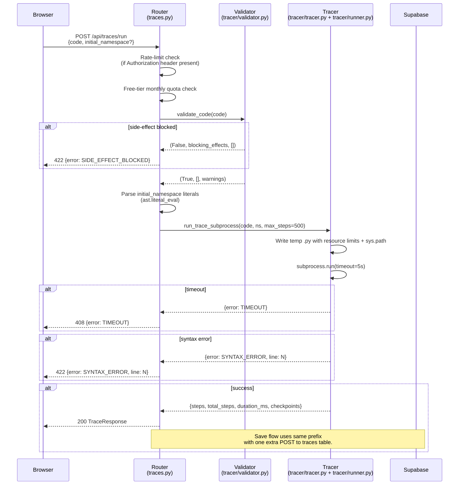
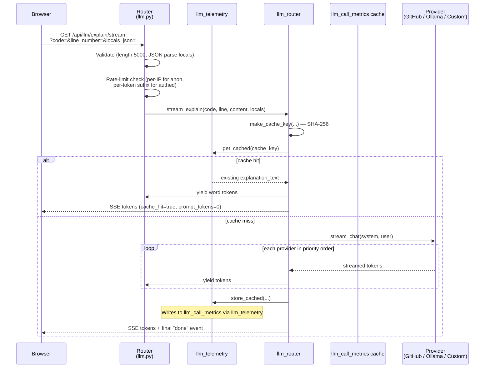
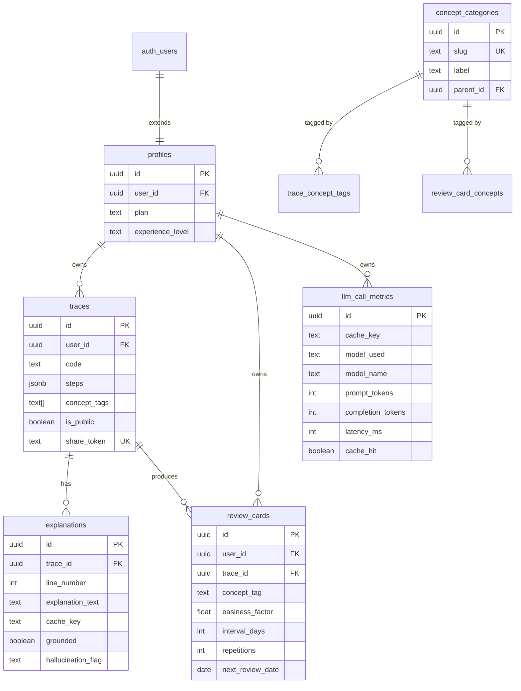

# Architecture

> Reference architecture for CogniTrace. Aimed at thesis committee members, new contributors, and the author's future self after a 6-month break.

This document covers:

1. High-level system diagram.
2. Request lifecycle for the trace endpoint.
3. Request lifecycle for the explanation stream endpoint.
4. Package layout and module responsibilities.
5. Data flow into and out of the database.

---

## 1. High-level system



Three discrete components communicate over HTTPS with the FastAPI process acting as the only author of Supabase tables.

---

## 2. Request lifecycle: `POST /api/traces/run`

This is the most complex endpoint. It is also the load-bearing path for the thesis, because it is the step that produces the trace data which (in Phase 2) gets injected into every LLM prompt.



Steps of interest:

- The validator runs **before** the subprocess is spawned. Failed validation is a 422, never a process start. This is a deliberate cost saving — spawning a subprocess for malicious input is the most expensive thing the server can do.
- The free-tier quota check is a `count()` against the `traces` table for the current user. This is intentionally a separate query, not a Redis counter, because the quota is on persistent traces (saved traces), not on trace runs.
- The tracer subprocess sets `rlimit(RLIMIT_AS, 256MB)` and `rlimit(RLIMIT_CPU, 4s)` *inside* the subprocess. The outer `subprocess.run(timeout=5s)` is a belt-and-suspenders backstop.

---

## 3. Request lifecycle: `GET /api/llm/explain/stream` (SSE)

This is the endpoint that does the actual trace conditioning work for the thesis.



Two design points to flag:

1. The rate-limit key is `jwt_token[-32:]` for authenticated users, not `user_id`. This means rotating JWTs rotates the rate-limit bucket. We accept this trade-off because JWTs in our setup are Supabase-managed and rotate on refresh.
2. Cache writes happen *after* the stream completes, not during. If the stream is interrupted mid-way, the cache is not poisoned. The cost is that the next identical request re-fetches from the provider — acceptable because token-by-token caching at this layer is more complex than the win justifies.

---

## 4. Package layout

### Backend

```
backend/
├── app/                          # FastAPI server entry
│   ├── main.py                   # FastAPI app, lifespan, middleware
│   ├── config.py                 # Pydantic Settings, .env reader
│   ├── dependencies.py           # Shared FastAPI dependencies
│   ├── concurrency.py            # Subprocess semaphore + run_with_concurrency_limit
│   ├── routers/                  # HTTP adapters (thin)
│   │   ├── traces.py             # POST /traces/run, /traces/fork
│   │   ├── traces_save.py        # POST /traces, GET /traces (list)
│   │   ├── traces_share.py       # /traces/{id}/share, /traces/shared/{token}
│   │   ├── dashboard.py          # GET /dashboard
│   │   ├── llm.py                # GET /explain/stream, POST /diagnose
│   │   ├── review.py             # SM-2 review endpoints
│   │   ├── profiles.py           # /profiles/* user settings
│   │   ├── examples.py           # /api/examples/* preset code samples
│   │   ├── ratings.py            # Explanation rating
│   │   ├── static_analysis.py    # AST pre-flight checks
│   │   ├── analytics.py          # Time-on-task, engagement events
│   │   └── auth.py               # get_current_user, get_profile_id
│   ├── services/                 # Business logic
│   │   ├── llm_router.py         # Provider-fallback chain
│   │   ├── llm_providers.py      # (extracted) CustomOpenAI / Ollama / GitHub
│   │   ├── llm_schemas.py        # Pydantic response validators
│   │   ├── llm_telemetry.py      # Token & latency recording
│   │   ├── trace_executor.py     # (extracted) validate-then-run helper
│   │   └── rate_limit.py         # Redis-backed sliding-window limiter
│   └── repositories/
│       └── supabase.py           # (reserved) thin Supabase data-access wrappers
├── tracer/                       # Algorithm (pure, no FastAPI)
│   ├── tracer.py                 # sys.settrace callback, _build_jump_map
│   ├── validator.py              # AST side-effect detector
│   ├── runner.py                 # Subprocess wrapper (sandbox + timeouts)
│   └── models.py                 # TraceStep, VariableInfo, SandboxError
├── migrations/                   # Numbered SQL migrations (Flyway-style)
│   ├── V001__initial_schema.sql
│   └── ...
└── tests/
    ├── unit/                     # 28 test files, isolated
    └── integration/              # 6 test files, exercise public surface
```

### Frontend

```
frontend/
├── app/                          # Next.js App Router pages
│   ├── layout.tsx                # Root layout
│   ├── page.tsx                  # Landing
│   ├── tracer/page.tsx           # Main tracer (uses extracted hooks)
│   ├── dashboard/page.tsx
│   ├── examples/[id]/page.tsx
│   ├── review/[card_id]/page.tsx
│   ├── trace/[share_token]/page.tsx
│   ├── pricing/page.tsx
│   └── auth/{login,signup,callback}/page.tsx
├── components/
│   ├── tracer/                   # VariablePanel, AnimationControls, etc.
│   ├── llm/                      # ExplanationPanel
│   ├── editor/                   # CodeEditor (Monaco wrapper)
│   ├── ui/                       # Button, Modal, ThemeToggle
│   └── errors/ErrorBoundary.tsx
├── hooks/                        # Custom React hooks
│   ├── useAuth.ts
│   ├── useTrace.ts               # rAF-based playback engine
│   ├── useTracePlayback.ts       # (extracted) wrapper
│   ├── useTraceAnnotations.ts    # (extracted) static-analysis
│   ├── useShareModal.ts          # (extracted) share modal state
│   ├── useWhatIf.ts              # (extracted) what-if modal state
│   ├── useCompareMode.ts         # (extracted) compare mode
│   ├── useTracerPageState.ts     # useReducer-backed state container
│   └── useStreamingExplanation.ts # SSE consumer
├── lib/
│   ├── api.ts                    # Typed fetch client
│   ├── supabase.ts               # Supabase client singleton
│   ├── sm2.ts                    # SM-2 algorithm
│   ├── analytics.ts              # time-on-task, event tracking
│   └── i18n.ts                   # next-intl wrapper
├── types/                        # Shared TS types
│   ├── trace.ts
│   ├── annotation.ts
│   └── user.ts
└── __tests__/ + e2e/             # Vitest unit + Playwright e2e
```

---

## 5. Database schema overview



(Workstream 4 normalizes `concept_tags` into `concept_categories`. Until that migration ships, `concept_tags` remains a TEXT[] on `traces`.)

---

## 6. Concurrency model

- **One FastAPI process per container.** Single CPU cap in `docker-compose.yml`.
- **One subprocess per trace request.** Capped at 25 concurrent subprocesses (`MAX_CONCURRENT_TRACES` in config). When the cap is reached, new requests wait on an `asyncio.Semaphore` until one completes.
- **One shared `httpx.AsyncClient`.** Initialised in the FastAPI lifespan, closed on shutdown. Connection pool: `max_keepalive=20, max_connections=100`. Verified by [`backend/tests/unit/test_httpx_reuse.py`](../../backend/tests/unit/test_httpx_reuse.py).
- **One Redis connection per app instance.** Lazy connect via [`backend/app/services/rate_limit.py`](../../backend/app/services/rate_limit.py).
- **No background workers.** All work is request-scoped. (Future: WebSocket or polling for trace-update notifications.)

---

## 7. Failure modes and how the system handles them

| Failure | Detection | Response | User-visible behaviour |
|---|---|---|---|
| Subprocess timeout | `subprocess.run(timeout=5s)` raises | Process killed, return 408 | Toast: "Execution took too long" |
| Subprocess OOM | `setrlimit(RLIMIT_AS, 256MB)` | Process killed, error reported | Toast: "Memory limit exceeded" |
| Subprocess syntax error | Caught inside subprocess, serialised to JSON | Return 422 with line number | Inline error highlight |
| Supabase rate-limit | Redis sliding window | Return 429 with Retry-After | Toast: "Try again in N seconds" |
| LLM provider all down | All providers raise | Fall through to error stream | Inline message: "AI explanations temporarily unavailable" |
| Branch detection fallback | `eval()` raises inside subprocess | `branches_taken["if"] = {"taken": null, "error": "could_not_evaluate"}` | Branch chip shows "uncertain" |
| Tracer trap `eval()` | Unreachable post-Workstream 5 | n/a | n/a |
