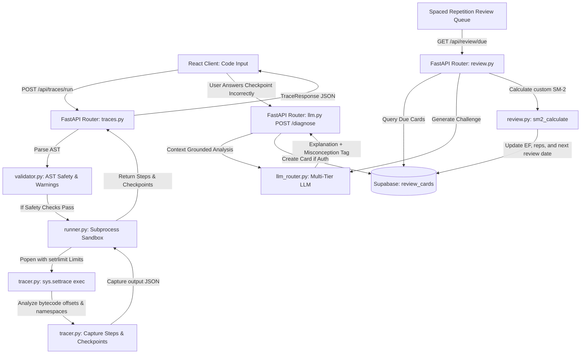

# CodeScope — Codebase Workflow Walkthrough

This document outlines the end-to-end execution lifecycle of the CodeScope backend (FastAPI) and frontend (React/Vite). It is designed to serve as a comprehensive walkthrough script and architectural guide for academic progress presentations and technical code reviews.

---

## 🗺️ System Pipeline & Data Flow

---

## 🛠️ Step-by-Step Execution Lifecycle

### Phase 1: Code Submission & Sandboxed Execution (The Run Flow)
When a student clicks "Run Trace" in the frontend, the code payload flows through safety checks to system execution.

#### 1. API Entry Point
*   **File**: `backend/app/routers/traces.py` ([traces.py](file:///c:/Users/quoct/codescope/backend/app/routers/traces.py#L130-L241))
*   **Route**: `POST /api/traces/run`
*   **Action**: Receives the Python code snippet and optional initial variable namespaces. It orchestrates static validation and sandboxed thread execution.

#### 2. Static AST Validation
*   **File**: `backend/tracer/validator.py` ([validator.py](file:///c:/Users/quoct/codescope/backend/tracer/validator.py#L1))
*   **Action**: Before parsing compilation blocks, we run the code through `validate_code()` using Python's native `ast` library.
    *   **Blocked Patterns**: It blocks imports targeting dangerous namespaces (`os`, `sys`, `subprocess`, `socket`, `requests`) and calls targeting system operations (e.g., `open()`, `eval()`).
    *   **Rule Engine**: Captures code patterns prone to semantic faults (e.g., `missing_none_guard` checking if a variable could trigger a `TypeError: 'NoneType' object is not subscriptable` or `mutable_default` argument declarations).
    *   **Failure**: If invalid patterns are matched, it aborts execution and raises a `422 Unprocessable Entity` response.

#### 3. Subprocess Sandboxing
*   **File**: `backend/tracer/runner.py` ([runner.py](file:///c:/Users/quoct/codescope/backend/runner.py))
*   **Action**: If static checks succeed, the backend writes the code to a temporary path and invokes it in an isolated subprocess (`subprocess.Popen`).
    *   **OS Constraints**: On POSIX-compliant systems, it uses `resource.setrlimit` to bind the subprocess to a **256MB RAM ceiling (`RLIMIT_AS`)** and a **4-second CPU clock time limit (`RLIMIT_CPU`)**, neutralizing infinite loops and memory bomb execution profiles.
    *   **Compatibility**: On Windows environments, OS ceilings default to process timeouts (5-second hard ceiling) managed by Python's `communicate(timeout=...)` pipeline.

---

### Phase 2: Bytecode-Level Tracing & Tutor Checkpoints (The Tracer Flow)
Once inside the isolated subprocess, CPython is structured to output step-by-step state information.

#### 1. CPython sys.settrace Interface
*   **File**: `backend/tracer/tracer.py` ([tracer.py](file:///c:/Users/quoct/codescope/backend/tracer/tracer.py#L138-L349))
*   **Action**: The wrapper script calls `sys.settrace(tracer_callback)` immediately prior to running `exec(compiled_code, user_namespace)`.
    *   **Filtering**: The callback ignores internal modules and only tracks frames executing under the `<codescope>` execution header.
    *   **Trace Callback Events**:
        *   `'line'`: Records execution steps. Captures active namespaces (variables), checks if variable string representations changed since the last line, and resolves compiler branch jumps.
        *   `'return'`: Catches the final namespace boundaries, which is critical for mapping values modified inside comprehensions.
        *   `'exception'`: Catches syntax and execution exceptions, mapping variable state frames at the exact offset the code crashed.

#### 2. Bytecode Branch & Conditional Evaluation
*   **File**: `backend/tracer/tracer.py` ([tracer.py](file:///c:/Users/quoct/codescope/backend/tracer/tracer.py#L44-L62))
*   **Action**: The tracer parses the code dynamically into an Abstract Syntax Tree to identify branch conditions (`ast.If`, `ast.For`, `ast.While`, `ast.BoolOp`).
    *   When the trace callback reaches an active conditional line, it identifies compiler jump conditions by comparing active bytecode offsets (`frame.f_lasti`) with a jump mapping compiled using the `dis` library.
    *   It evaluates the specific condition expression within the sandboxed namespace using an isolated, read-only `eval()` check. This flags if an `if` block evaluates to `True` or `False`, or if logical conditions (`and` / `or`) short-circuited.

#### 3. Tutor Checkpoints Generation
*   **File**: `backend/tracer/tracer.py` ([tracer.py](file:///c:/Users/quoct/codescope/backend/tracer/tracer.py#L351-L485))
*   **Action**: Once execution finishes, `generate_tutor_checkpoints()` walks the completed trace steps to produce prediction questions.
    *   **Checkpoint Ordering**: It prioritizes checking for `exception_prediction` (if the code crashes), followed by `branch_prediction` (asking which branch the control flow will enter next), and falls back to `variable_prediction` (asking what value a mutated variable will take on the next step).
    *   **Distractor Options**: Generates automated wrong answers based on the type of variable (e.g. empty arrays `[]` or increments of integers).

---

### Phase 3: Misconception Diagnosis & Spaced Repetition (The Review Flow)
If the student makes a prediction error, the system transitions into cognitive reinforcement.

#### 1. Misconception Diagnosis
*   **File**: `backend/app/routers/llm.py` ([llm.py](file:///c:/Users/quoct/codescope/backend/app/routers/llm.py#L155-L250))
*   **Route**: `POST /api/llm/diagnose`
*   **Action**: Receives the student's incorrect checkpoint choice.
    *   **LLM Query**: Sends the source code, current execution variables, correct option, and student's prediction to the `llm_router.py` explanation engine.
    *   **Response**: Returns a grounded analysis explaining the misconception, alongside a standardized tag (e.g., `off_by_one`, `state_mutation_confusion`, `none_dereference`).
    *   **Supabase Creation**: If the user is logged in, it inserts a new card into the `review_cards` table in Supabase. The card links to the specific code trace and is tagged with the misconception topic.

#### 2. Spaced Repetition Practice & Custom SM-2 Calculations
*   **File**: `backend/app/routers/review.py` ([review.py](file:///c:/Users/quoct/codescope/backend/app/routers/review.py#L94-L153))
*   **Route**: `GET /api/review/{card_id}` & `POST /api/review/{card_id}`
*   **Action**:
    *   **Challenge Generation**: When the user reviews a due card, the backend uses `llm_router.py` to dynamically produce a **Code Repair Challenge** mapping the tagged misconception (e.g. asking the student to rewrite the code to avoid the off-by-one error).
    *   **Quality Grading**: The LLM reviews the typed explanation or code fix to grade user proficiency.
    *   **SM-2 Scheduler Logic**: When the user self-rates their review quality (`again`, `hard`, `good`, `easy`), the backend updates the review schedule using the SuperMemo-2 scheduling matrix:
        $$\text{Easiness Factor (EF)} = EF_{old} + (0.1 - (5 - q) \times (0.08 + (5 - q) \times 0.02))$$
        *   **Custom Soft-Fail (Hard Rating)**: If the quality is evaluated as `hard` ($q=2$), instead of resetting repetitions to 0 and interval to 1 day (standard SM-2), the algorithm halvens the current interval and repetitions ($Rep = \lfloor Rep \div 2 \rfloor$, $I = \text{round}(I \times 0.5)$). This maintains retention momentum and mitigates review deck frustration.
        *   **Reschedule**: Saves the updated `easiness_factor`, `interval_days`, and `next_review_date` back to Supabase.
