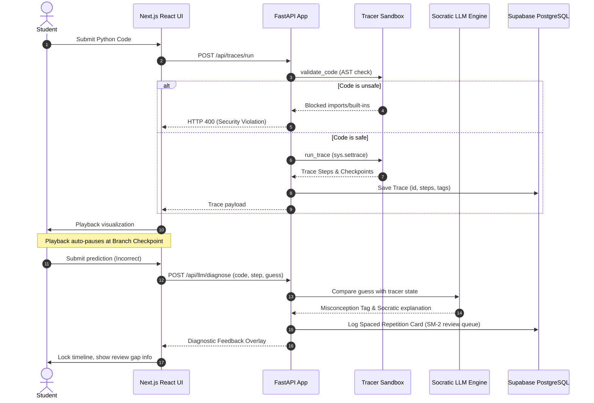

# Software Development Life Cycle (SDLC) Project Handover Report

**Project Code**: CodeScope (Personalized AI Tutor for AI-Assisted Coding)  
**System Architecture**: FastAPI Backend, Supabase PostgreSQL DB, Next.js 15 Frontend, Socratic Explanation Engine  
**Release Version**: v1.2.0 (Tutoring Loop & Core Performance Refactoring)  
**Classification**: Engineering & Operations Documentation  

---

## 1. SDLC Phase 1: Planning & Initiation

### 1.1 Problem Statement & Background
In modern programming education, students rely heavily on generative AI tools (e.g., ChatGPT, Claude, Copilot) to generate code snippets. However, this creates a "cognitive bypass" where students copy and paste code without understanding:
1. **Control Flow**: How loops, conditionals, and functions coordinate at runtime.
2. **Variable State**: How variables mutate step-by-step.
3. **Logic Safeguards**: Corner cases (e.g., `None` dereferencing, type mismatches, empty sequences).

CodeScope was initiated to solve this gap. It acts as an active learning visualizer and Socratic tutor. It intercepts execution traces, parses code for security and syntax anomalies, prompts students to predict next states, and schedules long-term retention reviews.

### 1.2 Tech Stack Selection & Constraints
* **Backend**: FastAPI (Python 3.12) is chosen for its native async capabilities and automatic OpenAPI schema generation, allowing high concurrency when streaming explanations via Server-Sent Events (SSE).
* **Tracer Sandbox**: Custom interpreter wrapper built on `sys.settrace()` to track execution without compiling to binary.
* **Database**: Supabase (PostgreSQL 15) handles client records, trace steps, and SRS review cards. Row-Level Security (RLS) policies are active on all tables to ensure data isolation.
* **LLM Core**: Ollama Cloud API (primary) with OpenAI API (fallback) to control costs and support local development.
* **Frontend**: Next.js 15 and React 19 provide a responsive UI, leveraging Monaco Editor for real-time code editing.

---

## 2. SDLC Phase 2: Requirements Analysis

```
                             +-------------------+
                             |  User Python Code |
                             +---------+---------+
                                       |
                                       v
                             +-------------------+
                             |  Static Analysis  |
                             |   (AST Scanner)   |
                             +---------+---------+
                                       |
                                       v
                             +-------------------+
                             |   Runtime Trace   |
                             |   (sys.settrace)  |
                             +---------+---------+
                                       |
                                       v
                             +-------------------+
                             | Socratic Checkpts |
                             |    Generator      |
                             +---------+---------+
                                       |
                 +---------------------+---------------------+
                 | (Correct Answer)                          | (Incorrect Answer)
                 v                                           v
     +-----------------------+                   +-----------------------+
     | Continue Visualizer   |                   | Diagnose Misconceptions|
     | Playback              |                   | & Log Review Card     |
     +-----------------------+                   +-----------+-----------+
                                                             |
                                                             v
                                                 +-----------------------+
                                                 | Spaced Repetition     |
                                                 | Review (SM-2) Queue   |
                                                 +-----------------------+
```

### 2.1 Functional Requirements (FR)
* **FR-1: AST Static Linting (Phase 0)**: Check Python code via AST analyzer for buggy or risky patterns (e.g. missing `None` check, implicit type coercions, wrong index types, unguarded mutations).
* **FR-2: Sandboxed Runtime Tracing (Phase 1)**: Capture local namespaces, call stacks, variable modifications, and branch transitions on each interpreter step.
* **FR-3: Socratic Branch Interceptions**: Pause trace playback automatically at branch junctions (conditionals, loops) to present predictive quizzes to the student.
* **FR-4: State-Grounded LLM Diagnostics (Phase 2)**: Diagnose student quiz answers using the exact runtime variables. Tag conceptual gaps with specific misconception tags (e.g. `off_by_one`, `none_dereference`).
* **FR-5: Spaced Repetition reviewing (Phase 3)**: Keep a review queue of conceptual cards. Tagged cards automatically generate code-repair debugging challenges matching the logged misconception.
* **FR-6: Active Recall Grading**: Grade submitted code corrections using LLM-based code verification.

### 2.2 Non-Functional Requirements (NFR)
* **NFR-1: Sandbox Security**: Prevent arbitrary code executions during runtime tracing (block file I/O, subprocesses, network, thread spawns, socket manipulation).
* **NFR-2: Connection Optimization**: Maintain low API response times (<50ms connection overhead) via persistent connection pooling.
* **NFR-3: High-Resolution Durations**: Trace execution timing must accurately profile statement complexity.
* **NFR-4: Database Policy Efficiency**: Row-Level Security checks must not execute full scans or nested loop operations.

---

## 3. SDLC Phase 3: System & Database Design

### 3.1 Architectural Workflow
CodeScope splits system operations into four distinct execution phases:



---

### 3.2 Database Schema Definitions (PostgreSQL SQL DDL)

Here are the table definitions, showing the constraints and indexing structure:

```sql
-- Profiles (extends Supabase auth.users)
CREATE TABLE profiles (
    id               UUID PRIMARY KEY DEFAULT gen_random_uuid(),
    user_id          UUID REFERENCES auth.users(id) ON DELETE CASCADE,
    experience_level TEXT CHECK (experience_level IN ('student', 'junior', 'mid')),
    ai_tools_usage   TEXT CHECK (ai_tools_usage IN ('none', 'light', 'moderate', 'heavy')),
    python_years     INT DEFAULT 0,
    ollama_endpoint  TEXT DEFAULT 'https://ollama.com/api',
    stripe_customer_id TEXT,
    plan             TEXT DEFAULT 'free' CHECK (plan IN ('free', 'pro')),
    created_at       TIMESTAMPTZ DEFAULT now()
);

-- Traces
CREATE TABLE traces (
    id           UUID PRIMARY KEY DEFAULT gen_random_uuid(),
    user_id      UUID REFERENCES profiles(id) ON DELETE CASCADE,
    code         TEXT NOT NULL,
    language     TEXT DEFAULT 'python',
    steps        JSONB NOT NULL,
    concept_tags TEXT[] DEFAULT '{}',
    is_public    BOOLEAN DEFAULT false,
    share_token  TEXT UNIQUE DEFAULT encode(gen_random_bytes(16), 'hex'),
    created_at   TIMESTAMPTZ DEFAULT now()
);

-- Review Cards (spaced repetition)
CREATE TABLE review_cards (
    id               UUID PRIMARY KEY DEFAULT gen_random_uuid(),
    user_id          UUID REFERENCES profiles(id) ON DELETE CASCADE,
    trace_id         UUID REFERENCES traces(id) ON DELETE CASCADE,
    concept_tag      TEXT,
    easiness_factor  FLOAT DEFAULT 2.5,
    interval_days    INT DEFAULT 1,
    repetitions      INT DEFAULT 0,
    next_review_date DATE,
    last_reviewed_at TIMESTAMPTZ,
    created_at       TIMESTAMPTZ DEFAULT now()
);

-- Explanations (cached LLM responses)
CREATE TABLE explanations (
    id                UUID PRIMARY KEY DEFAULT gen_random_uuid(),
    trace_id          UUID REFERENCES traces(id) ON DELETE CASCADE,
    line_number       INT NOT NULL,
    explanation_text  TEXT NOT NULL,
    cache_key         TEXT NOT NULL,
    model_used        TEXT DEFAULT 'ollama',
    model_name        TEXT,
    cached            BOOLEAN DEFAULT false,
    human_rating      INT CHECK (human_rating BETWEEN 1 AND 5),
    pattern_category  TEXT,
    created_at        TIMESTAMPTZ DEFAULT now()
);

-- Indexes
CREATE INDEX idx_traces_user_id ON traces(user_id);
CREATE INDEX idx_traces_share_token ON traces(share_token);
CREATE INDEX idx_review_cards_user_id ON review_cards(user_id);
CREATE INDEX idx_review_cards_next_date ON review_cards(next_review_date);
CREATE INDEX idx_explanations_cache_key ON explanations(cache_key);
CREATE INDEX idx_explanations_trace_id ON explanations(trace_id);
CREATE INDEX idx_review_cards_user_next_date ON review_cards(user_id, next_review_date);
```

---

## 4. SDLC Phase 4: Implementation (CT-01 to CT-06)

We resolved six performance and security bottlenecks in this release:

### 4.1 Connection Pool Optimization (CT-01)
* **Architectural Issue**: The backend instantiated a new `httpx.AsyncClient` inside every database query helper and router call. This triggered a TCP handshake and TLS negotiation (~20-50ms) for each request, leading to socket exhaustion under heavy load.
* **Resolution**: Configured a lifecycle-managed singleton `httpx.AsyncClient` on application startup in `backend/app/main.py`. This client is shared across routers via dependency injection in `backend/app/dependencies.py`.
* **Testing Fallback**: Added a dynamic fallback initializer in `get_http_client` to prevent tests from failing when lifespan lifecycle hooks are bypassed.

```python
# backend/app/dependencies.py
async def get_http_client(request: Request) -> httpx.AsyncClient:
    """FastAPI dependency to retrieve the application-wide shared HTTP client."""
    if not hasattr(request.app.state, "http_client"):
        request.app.state.http_client = httpx.AsyncClient(timeout=10.0)
    return request.app.state.http_client
```

---

### 4.2 High-Resolution Tracer step timing (CT-02)
* **Architectural Issue**: Step durations were calculated by dividing total execution time equally among all steps. This hid the execution footprint of loops or heavy statements.
* **Resolution**: Updated `tracer_callback` in [tracer.py](file:///c:/Users/quoct/codescope/backend/tracer/tracer.py) to capture performance deltas using `time.perf_counter()`.
* **Snippet**:
```python
# backend/tracer/tracer.py
        if event == "line":
            current_time = time.perf_counter()
            elapsed_ms = (current_time - last_time) * 1000
            last_time = current_time
            if steps:
                steps[-1].duration_ms = round(elapsed_ms, 3)
```

---

### 4.3 Supabase EXISTS-based RLS Policies (CT-03)
* **Architectural Issue**: Row-Level Security checks used `IN (SELECT...)` subqueries, causing nested scans and slowing down database lookups.
* **Resolution**: Created migration `V007__optimize_rls_policies.sql` to replace subqueries with fast, index-friendly `EXISTS` clauses.

```sql
-- Recreate policies using high-performance EXISTS
CREATE POLICY "own_traces" ON traces FOR ALL
    USING (EXISTS (
        SELECT 1 FROM profiles 
        WHERE profiles.id = traces.user_id 
          AND profiles.user_id = auth.uid()
    ));
```

---

### 4.4 Static Analysis Noise Reduction (CT-04)
* **Architectural Issue**: Broad rules warned users about implicit non-boolean truthiness checks (e.g., `if items:`), adding unnecessary noise.
* **Resolution**: Demoted the severity of `implicit_truthiness` check annotations to `low` in `backend/analyzers/static_analysis.py`.
* **Snippet**:
```python
# backend/analyzers/static_analysis.py
    annotations.append(
        Annotation(
            line=node.lineno,
            severity="low",
            pattern_id="implicit_truthiness",
            message=(
                f"`if {name}:` is True for `{name}=[]`, `{name}={{}}`, "
                f"`{name}=0`, and `{name}=None` — not just when it has values."
            ),
            suggestion=f"Use explicit check: if {name} is not None and len({name}) > 0:",
        )
    )
```

---

### 5.5 Monaco Editor Keystroke Drops (CT-05)
* **Architectural Issue**: Intellisense and suggestion popups in Monaco Editor dropped space keypresses during rapid typing.
* **Resolution**: Configured the editor in `frontend/components/editor/CodeEditor.tsx` to disable suggestions and quick hints.

```typescript
const editorOptions = {
  automaticLayout: true,
  quickSuggestions: { other: false, comments: false, strings: false },
  wordBasedSuggestions: "off",
  parameterHints: { enabled: false },
  suggestOnTriggerCharacters: false,
};
```

---

### 5.6 Adaptive SM-2 Soft-Fail review Scheduling (CT-06)
* **Architectural Issue**: Selecting "Hard" (quality = 2) reset repetitions to 0 and the interval to 1 day, creating a bottleneck for long-term cards.
* **Resolution**: Halved the interval and repetitions instead of resetting them completely, maintaining card history.

```python
# backend/app/routers/review.py
    if quality < 2:
        new_interval = 1
        new_repetitions = 0
    elif quality == 2:
        new_repetitions = max(1, repetitions // 2)
        new_interval = max(1, round(interval_days * 0.5))
```

---

## 5. SDLC Phase 5: Testing & Quality Assurance

All test suites were executed to verify code correctness, safety, and performance constraints.

### 5.1 Test Statistics Overview
```
+--------------------------------------+-----------------------------------+
| TEST SUITE                           | OUTCOME                           |
+--------------------------------------+-----------------------------------+
| Backend pytest Suite                 | 280 / 280 Tests Passed (100% Rate)|
| Frontend Vitest Suite                | 41 / 41 Tests Passed (100% Rate)  |
| TypeScript Typechecking              | tsc --noEmit: Passed              |
+--------------------------------------+-----------------------------------+
```

### 5.2 Tracer Security Sandbox Testing
To verify sandboxing, the backend runs test cases targeting specific security threats:
* **Import Blocking**: Verified that importing blocked modules (`os`, `sys`, `ctypes`, `threading`, `multiprocessing`) raises `400 Bad Request`.
* **Dangerous Built-ins**: Confirmed that executing functions like `eval()`, `exec()`, `open()`, and `breakpoint()` is blocked.
* **Namespace Protection**: Ensured variables like `__builtins__` or `__globals__` cannot be accessed to bypass sandboxing rules.

---

## 6. SDLC Phase 6: Deployment & Operations

### 6.1 Database Migration Procedure
Execute `backend/migrations/V007__optimize_rls_policies.sql` to apply the optimized RLS policies.
```bash
# Example running migrations via pg_dump/psql client
psql -h db.supabase.co -U postgres -d postgres -f V007__optimize_rls_policies.sql
```

### 6.2 Host Setup & Environment
The FastAPI backend is executed via Uvicorn under standard configuration:
```bash
uv run uvicorn app.main:app --host 0.0.0.0 --port 8000 --workers 4
```

Verify that production environments configure these variables:
* `SUPABASE_URL`: Target DB Endpoint.
* `SUPABASE_SERVICE_KEY`: Service auth token.
* `OLLAMA_CLOUD_ENDPOINT`: Socratic AI text generator model API url.
* `OPENAI_API_KEY`: Fallback LLM endpoint.
