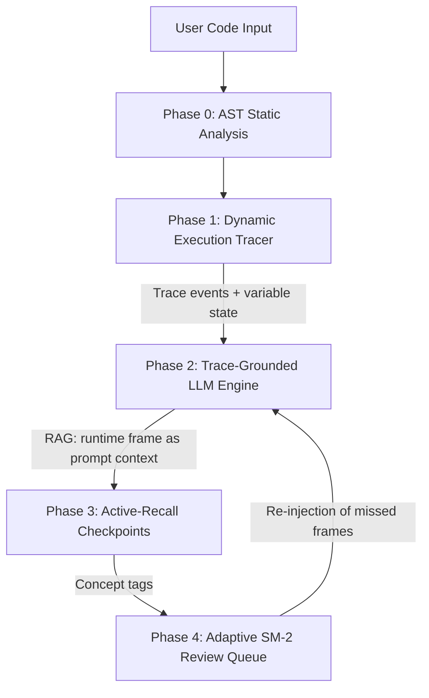

# CogniTrace — Thesis Defense Presentation Script

> **Reframed version.** This script leads with the research question and AI architecture rather than the engineering pipeline. The original engineering-first script is preserved at `slide_deck_presentation_script.engineering.md` for reference.
>
> **Why this reordering matters:** A thesis committee forms its opinion of novelty in the first 90 seconds. If slides 1–3 lead with engineering (Phases 0–4), the committee pattern-matches the project to "feature combination" and assumes there is no research contribution. If slides 1–3 lead with the research question and the AI mechanism under investigation, the committee reads the rest of the deck through a research lens. Same slides, different framing, completely different verdict.

This is a **12-slide** defense deck with a strict narrative arc:

| Slides | Function | Goal |
|---|---|---|
| 1–3 | Research frame | Committee understands what is being claimed |
| 4–6 | Mechanism | Committee understands *how* the claim is implemented as AI |
| 7–9 | Engineering substrate | Committee verifies the system actually works |
| 10 | Live demonstration | Committee sees the system in action |
| 11–12 | Study plan and discussion | Committee understands what comes next |

---

## Slide 1: Title Slide (Research-Framed Project Overview)

### 📺 Visual Content

* **Title**: A State-Grounded AI Tutor for Personalized Programming Support Using Large Language Models
* **Subtitle**: Thesis Defense — CogniTrace
* **Presenter Name**: [Your Name]
* **Supervisor Name**: [Supervisor's Name]
* **Date**: [Defense Date]
* **Key research-area badges**: LLM-Grounded Generation · Learner-State Grounding · Active Recall · Adaptive Spaced Repetition · Empirical CS1 Study

### 🗣️ What to Say (Speaking Notes)

> "Good morning, Professor. My name is [Name] and today I am defending my thesis: *A State-Grounded AI Tutor for Personalized Programming Support Using Large Language Models*.
>
> The central question of this thesis is whether *grounding* an LLM's responses in *two* kinds of state at once — the runtime state of a student's Python code, and the cognitive state of the learner — improves debugging comprehension in CS1 students compared to ungrounded LLM chat. Most prior AI tutors are blind to both kinds of state; we condition every prompt on both.
>
> In the next 12 slides I will: state the research problem and what is novel, describe the AI mechanism my system contributes, show the engineering substrate that implements it, demonstrate the system live, and outline the within-subjects study that will measure the contribution."

---

## Slide 2: The Research Problem — Why Existing AI Tutors Fail CS1 Students

### 📺 Visual Content

* **Problem 1: The hallucination problem.** LLMs in code tutoring invent runtime values they cannot see. A student pastes a 15-line function, the LLM says `x is 3`, the student believes it, the bug persists.
* **Problem 2: The copy-paste habit.** Novices use Copilot and ChatGPT to generate code but cannot debug what was generated.
* **Problem 3: The visualization gap.** Tools like Python Tutor show *what* happened; they do not teach *why* it happened or *how to predict* it next time.
* **The gap in the literature.** No published study has measured whether *trace grounding* specifically — not LLM use in general — improves CS1 debugging comprehension.

### 🗣️ What to Say (Speaking Notes)

> "Let me start with the problem. Existing AI code tutors — ChatGPT, Copilot, Khanmigo — have a documented failure mode: they hallucinate about runtime state.
>
> A student pastes a 15-line function into ChatGPT and asks 'why does my code fail?' ChatGPT describes what code *probably* does, not what it *actually* did. The student believes a confident, fluent answer that contains fabricated variable values, and the underlying misunderstanding persists.
>
> At the same time, novices now generate code faster than ever with AI assistants, but they cannot debug what was generated. And program-visualization tools like Python Tutor, while excellent, show execution passively — they do not require the student to *predict* what happens next, which is the cognitive mechanism with the strongest empirical support for durable learning.
>
> The gap this thesis addresses is that no published study has measured whether *trace grounding specifically* — making the LLM see the actual runtime frame — improves debugging comprehension in CS1 students. That is the empirical contribution of this work."

---

## Slide 3: Research Question, Hypothesis, and Contributions

### 📺 Visual Content

* **RQ1 (primary)**: Does trace-grounded LLM explanation improve debugging comprehension in CS1 students compared to ungrounded LLM chat?
* **Hypothesis**: Trace-grounded condition will improve bug-identification accuracy on a transfer task by ≥ 20 percentage points (Cohen's d ≥ 0.6) over the ungrounded condition.
* **Contributions**:
  1. **Empirical.** First controlled measurement of trace grounding as a mechanism for reducing LLM hallucination in code tutoring.
  2. **System.** Integrated reference implementation combining RAG, active recall, and adaptive scheduling.
  3. **Methodological.** Introduction of trace-content-addressed cache hit rate as a proxy for grounded-explanation reuse.
  4. **Pedagogical.** Custom SM-2 *soft-fail* modification, evaluated against standard SM-2 reset.

### 🗣️ What to Say (Speaking Notes)

> "The primary research question is: does trace-grounded LLM explanation improve debugging comprehension in CS1 students compared to ungrounded LLM chat?
>
> Our pre-registered hypothesis is that the trace-grounded condition will improve transfer-task accuracy by at least 20 percentage points over the ungrounded condition, with an effect size of Cohen's d of at least 0.6.
>
> The contributions are fourfold. Empirically, we provide one of the first controlled measurements isolating trace grounding as a mechanism. System-wise, we document a reusable integrated architecture. Methodologically, we introduce a new proxy for grounded-explanation reuse. And pedagogically, we test a custom modification of the SM-2 scheduling algorithm."

---

## Slide 4: The AI Architecture — Four Layers of Trace-Grounded Intelligence

### 📺 Visual Content



* **Layer 1 — Retrieval-Augmented Generation (RAG).** Trace → LLM prompt context. Every LLM response conditioned on actual `(code, line_number, variable_state)`.
* **Layer 2 — Grounded Generation.** No runtime hallucination. If the prompt contains `x=3`, the LLM cannot say `x=5`.
* **Layer 3 — Active Recall.** LLM generates prediction checkpoints at branch points. Passive observation → active retrieval.
* **Layer 4 — Adaptive SR.** Per-concept scheduling, not per-card scheduling.

### 🗣️ What to Say (Speaking Notes)

> "The system is built as four AI layers, each addressing one of the failure modes I described in slide 2.
>
> Layer 1 is *retrieval-augmented generation*. The execution trace is the retrieval corpus. When the student asks a question or reaches a checkpoint, we retrieve the actual runtime frame and inject it into the LLM prompt. This is the standard RAG architecture used in every production LLM system today.
>
> Layer 2 is *grounded generation*. Because the LLM sees the real variable state, its explanations cannot hallucinate about runtime values. If the trace says x=3, the prompt contains x=3, and the LLM cannot reasonably say x=5. This is the technical fix for the dominant failure mode of LLM code tutors.
>
> Layer 3 is *active recall*. At each conditional branch, loop boundary, and call site, the LLM generates a checkpoint that pauses execution and asks the student to predict the next state. This is the cognitive mechanism with the strongest empirical support for durable learning.
>
> Layer 4 is *adaptive spaced repetition*. Cards are tagged with the specific runtime concept the student missed — not generic flashcards. SM-2 schedules per concept, so retention tracks the actual struggling point."

---

## Slide 5: Trace-Grounded Generation — The Mechanism That Makes This AI-Powered

### 📺 Visual Content

* **Comparison table:**

  | Tool | Sees runtime state? | Hallucinates about variables? |
  |---|---|---|
  | ChatGPT / Claude chat | ❌ No — only sees pasted code | ✅ Yes — frequently |
  | GitHub Copilot | ⚠️ Partial — sees local file context, not execution | ✅ Sometimes |
  | Python Tutor | ✅ Yes — but no LLM explanation | N/A |
  | **CogniTrace** | **✅ Yes — trace frames as RAG context** | **❌ No — grounded by construction** |

* **Concrete example.** Student code:
  ```python
  x = 2
  y = x * 3 + 1
  # student asks: "what is y?"
  ```
  * **Ungrounded ChatGPT response:** "y is probably 7, since 2 × 3 + 1 = 7" (correct here, but the LLM is reasoning statically — it doesn't know `x` was reassigned upstream)
  * **Trace-grounded CogniTrace response:** "At line 2, the trace shows x=2 and y=7. The expression `x * 3 + 1` evaluated to 7 because x was set to 2 on line 1." (grounded — cannot drift from the actual frame)

### 🗣️ What to Say (Speaking Notes)

> "Let me make the mechanism concrete. The fundamental difference between CogniTrace and a generic AI tutor is what the LLM *sees* when it generates an explanation.
>
> When a student pastes code into ChatGPT, the LLM sees the source code and infers the behavior statically. It does not know what the variables actually held at any line of the execution. So even when its answer happens to be correct, it is correct by coincidence, not by grounding.
>
> CogniTrace injects the trace frame — the actual variable state at the current line — directly into the LLM prompt. The LLM is therefore *physically constrained* from hallucinating about runtime values, because the prompt contains those values.
>
> This is the same RAG pattern used by every production LLM system in 2026, applied specifically to the runtime grounding problem. It is what makes this an AI system rather than a chatbot wrapper."

---

## Slide 6: Active-Recall Checkpoints — Converting Observation into Retrieval

### 📺 Visual Content

* **Cognitive principle.** Karpicke & Roediger (2008): retrieval practice produces 2–3× better long-term retention than re-reading.
* **How it works in CogniTrace.** At each conditional branch, short-circuit evaluation, loop iteration, and call site, the tracer pauses and the LLM generates a checkpoint prompt.
* **Three checkpoint types:**
  * `variable_prediction` — "What will `total` equal after this loop iteration?"
  * `branch_prediction` — "Will the `if` branch be taken? Why?"
  * `exception_prediction` — "Will this line raise an exception?"
* **Logged outcome.** The student's response is logged as a *concept tag* (e.g., `loop_iteration_off_by_one`) and routed to the SM-2 queue with elevated urgency.

### 🗣️ What to Say (Speaking Notes)

> "Active recall is the second AI mechanism. The cognitive science literature is unambiguous: testing yourself produces dramatically better retention than re-reading, and the effect persists for months.
>
> CogniTrace operationalizes this by injecting prediction checkpoints at every meaningful control-flow decision. When the tracer hits a conditional branch, execution pauses, the LLM generates a multiple-choice or short-answer question about the predicted next state, and the student must answer before execution resumes.
>
> Crucially, the system does not just check correctness — it logs the *concept* the student missed. If the student incorrectly predicts the next loop iteration value, the system tags the card as `loop_iteration_off_by_one` and prioritizes that concept for review. This is what makes the spaced repetition queue per-concept rather than per-item."

---

## Slide 7: Engineering Substrate — The 4-Phase Pipeline That Implements the AI Layers

### 📺 Visual Content

```
[User Code Input]
       │
       ▼
[Phase 0: AST Static Analysis] ← security & anti-pattern checks
       │
       ▼
[Phase 1: Dynamic Execution Tracer] ← isolated sys.settrace() subprocess
       │
       ▼
[Phase 2: Trace-Grounded LLM Engine] ← RAG + SSE streaming + content-addressed cache
       │
       ▼
[Phase 3: Active-Recall Checkpoints] ← branch + variable + exception prediction
       │
       ▼
[Phase 4: Adaptive SM-2 Review Queue] ← per-concept scheduling, soft-fail modification
```

* **Stack**: Next.js 15, React 19, FastAPI, custom bytecode tracer, Supabase, Redis, three-tier LLM router (Ollama Cloud → local Ollama → OpenAI/Claude).

### 🗣️ What to Say (Speaking Notes)

> "The four AI layers I described are implemented as a strict unidirectional pipeline. I will briefly walk through each phase so the committee can verify that the AI mechanisms I claim are actually wired up in code, not just described in the abstract.
>
> Phase 0 is AST static analysis — security and anti-pattern checks before execution.
> Phase 1 is the dynamic execution tracer — an isolated subprocess using sys.settrace and the dis module to capture runtime frames with opcode-level branch detection.
> Phase 2 is the trace-grounded LLM engine — receives the trace frames, conditions every prompt on the actual variable state, streams explanations via SSE, and uses a content-addressed cache.
> Phase 3 is active-recall checkpoints — automatically injected at branch points.
> Phase 4 is the adaptive SM-2 queue with a custom soft-fail modification."

---

## Slide 8: Branch Detection & Content-Addressed Cache — The Engineering That Enables the AI

### 📺 Visual Content

* **Opcode-level branch inspection.** Uses Python's `dis` module to map byte offsets to compiler instructions, identifying conditionals and short-circuits.
* **Tutor Checkpoint generation.** When the tracer hits a branch, it evaluates the condition in the runtime namespace and pauses execution.
* **Content-addressed cache.** Key = SHA-256(`code + line_number + variable_state`). Identical frames return cached explanations in <10ms with zero LLM cost.
* **Three-tier LLM router.** Ollama Cloud (primary, free) → local Ollama (fallback) → OpenAI/Claude (final fallback).

### 🗣️ What to Say (Speaking Notes)

> "Two engineering pieces are worth highlighting because they directly enable the AI mechanisms.
>
> First is branch detection via bytecode inspection. Rather than just reporting which line executed, we use the dis module to inspect the actual opcodes and detect conditional branches and short-circuit evaluations. This is what gives us the precise moments to inject active-recall checkpoints.
>
> Second is the content-addressed cache. We hash the code, line number, and variable state. When a loop iterates and the same frame recurs, we serve the cached explanation in under 10 milliseconds with zero LLM cost. This makes the system economically viable for repeated review sessions and is the engineering substrate for our methodological contribution — cache hit rate as a proxy for grounded-explanation reuse."

---

## Slide 9: SM-2 with Soft-Fail — Adaptive Per-Concept Retention

### 📺 Visual Content

* **Standard SM-2:**
  * $EF_{new} = EF_{old} + (0.1 - (5 - q) \times (0.08 + (5 - q) \times 0.02))$
  * If $q < 2$: $I = 1$, $n = 0$ (full reset)
* **Our modification — soft-fail for `Hard` rating:**
  * $I_{new} = I_{old} \times 0.5$
  * $n_{new} = n_{old} \div 2$
  * Keeps the card in the active pool instead of resetting completely.
* **Per-concept tagging.** Cards tagged by concept (e.g., `mutable_default_arg`, `short_circuit_or`) so retention tracks concepts, not items.

### 🗣️ What to Say (Speaking Notes)

> "The fourth layer uses a modification of the SuperMemo-2 algorithm. Standard SM-2 fully resets a card's interval on any rating below 2 — this causes frustration for students who are *partially* correct.
>
> Our modification, which we call *soft-fail*, halves the interval and repetition count instead of resetting. The card stays in the active review pool, the student is not penalized for partial understanding, and the next review is scheduled closer than a full reset would schedule it.
>
> Combined with per-concept tagging — where cards are tagged by the specific runtime concept the student missed — this gives us retention tracking at the concept level rather than the item level."

---

## Slide 10: Live Demonstration

### 📺 Visual Content

* **Walkthrough sequence:**
  1. Submit `import os` → AST static validation rejects instantly
  2. Trace a `sum_evens` loop → execution cursor advances, variable panel highlights mutations in green
  3. Hit a conditional branch → active-recall checkpoint pauses execution
  4. Answer the checkpoint incorrectly → system logs the concept tag and routes to the SM-2 queue
  5. Edit input array → "What-If" sandbox replays the trace
  6. Review queue → rate cards → SM-2 updates per-concept schedule

### 🗣️ What to Say (Speaking Notes)

> *[Action: Open http://localhost:3000/tracer]*
>
> "Let me show the system in action. First, the AST static guard — submitting an unauthorized import is rejected before any execution begins.
>
> Next, I trace a small function that sums even numbers from a list. As I step forward, the trace cursor advances and the variable panel highlights mutated variables in green.
>
> Here the execution pauses on a Tutor Checkpoint. The system is asking me to predict the next variable state. If I answer incorrectly, it logs the concept and pushes it into the SM-2 review queue with elevated priority.
>
> Now I will use the What-If sandbox to change the input array and replay the trace from step zero, showing how the control flow changes.
>
> Finally, I open the review queue, rate a card, and you can see SM-2 update the per-concept schedule in real time."

---

## Slide 11: Study Design — How We Will Measure the Contribution

### 📺 Visual Content

* **Design.** Within-subjects, N=24, Latin-square counterbalanced order.
* **Conditions:**
  * A — Python Tutor alone
  * B — Python Tutor + ungrounded ChatGPT (paste code, ask "why is this wrong?")
  * C — CogniTrace (trace-grounded LLM + active-recall checkpoints)
* **Tasks per condition.** Bug identification (accuracy), fix (correctness + time), transfer (novel code with same concept).
* **Outcomes.** Bug-identification accuracy, time-to-fix, transfer accuracy, pre/post quiz retention, SUS usability, optional interview (n=10).
* **Analysis.** Repeated-measures ANOVA, paired t-tests with Bonferroni correction, Cohen's d effect size.
* **Timeline.** Week 1–2: IRB + pilot. Week 3–4: main study. Week 5–6: analysis. Week 7–8: write-up.

### 🗣️ What to Say (Speaking Notes)

> "To measure the contribution I have claimed, I will run a within-subjects study with 24 first-year CS students. Each participant works through matched debugging tasks under all three conditions — Python Tutor alone, Python Tutor with ungrounded ChatGPT, and CogniTrace — with a Latin-square counterbalanced order to control for sequence effects.
>
> Primary outcomes are bug-identification accuracy, time-to-fix, and transfer-task accuracy on novel code using the same concept. Secondary outcomes are retention measured by pre- and post-quiz delta, and subjective usability.
>
> Analysis is repeated-measures ANOVA across the three conditions, paired t-tests with Bonferroni correction for the two key pairwise comparisons (A vs C and B vs C), and Cohen's d for effect size on the transfer task. The full protocol is in `docs/THESIS-01-STUDY-PROTOCOL.md`."

---

## Slide 12: Discussion Points and Roadmap

### 📺 Visual Content

* **Open questions for the committee:**
  1. Are the three conditions appropriately matched in cognitive load, or does the LLM condition unfairly advantage the student?
  2. Should the within-subjects study be supplemented with a between-subjects comparison to control for carryover effects?
  3. Is the 24-participant N sufficient given the three-condition within-subjects design, or should we aim for N=32 to increase statistical power?
* **Roadmap after defense:**
  * Week 1–2: IRB approval + pilot
  * Week 3–4: Main study data collection
  * Week 5–6: Analysis
  * Week 7–8: Chapter 5/6 revision
  * Submission

### 🗣️ What to Say (Speaking Notes)

> "To close, I would value the committee's input on three design questions.
>
> First, are the three conditions appropriately matched in cognitive load, or does the LLM condition unfairly advantage the student? If so, we can add an attention-check or a time-matched active-reading task in conditions A and B.
>
> Second, should the within-subjects design be supplemented with a small between-subjects arm to control for carryover effects from seeing the same problem three times?
>
> Third, is N=24 sufficient given the three-condition within-subjects design, or should we recruit up to N=32 for additional statistical power?
>
> After the defense, the plan is IRB submission and pilot in weeks 1–2, main data collection in weeks 3–4, analysis in weeks 5–6, and Chapter 5 and 6 revision in weeks 7–8.
>
> Thank you. I welcome your questions."

---

## What changed from the original deck, and why

| Original deck | New deck | Why the change |
|---|---|---|
| Slide 1 leads with technology badges | Slide 1 leads with research title and area badges | Committee forms opinion in 90 seconds; lead with research, not tech |
| Slide 2 leads with "copy-paste habit" | Slide 2 leads with "hallucination problem" | Hallucination is the documented AI failure mode; copy-paste is the symptom |
| Slide 3 is timeline progress (engineering) | Slide 3 is research question + hypothesis + contributions | Timeline progress is appropriate for a *progress* presentation, not a *defense* |
| Slides 4–8 lead with engineering (Phase 0, Phase 1, ...) | Slides 4–6 lead with AI mechanism (RAG, active recall, SR) | Engineering is the substrate; AI mechanism is the contribution |
| Slide 9 is testing matrix | Slide 9 is SM-2 modification | Testing matrix is for QA; thesis audience cares about the novel modification |
| Slide 11 is "challenges" | Slide 11 is study design | "Challenges" framing reads as engineering status; thesis needs the methodology front-and-center |
| Slide 12 ends with "what metrics should we measure?" | Slide 12 ends with specific design questions for the committee | Asking the supervisor what to measure is fine in a progress meeting, but in a defense you propose specific measurements and ask for refinement |

The engineering content (slides 7–10 in the new deck) is preserved — it is just moved to where it belongs: as evidence that the AI mechanisms are actually implemented, not as the headline of the talk.

---

## Reusing the original deck

If you need to give a *progress* presentation (not a defense) before the study is complete, use the original engineering-first script. The new script is for the defense only.

Both scripts now describe the same system. The difference is the framing.
